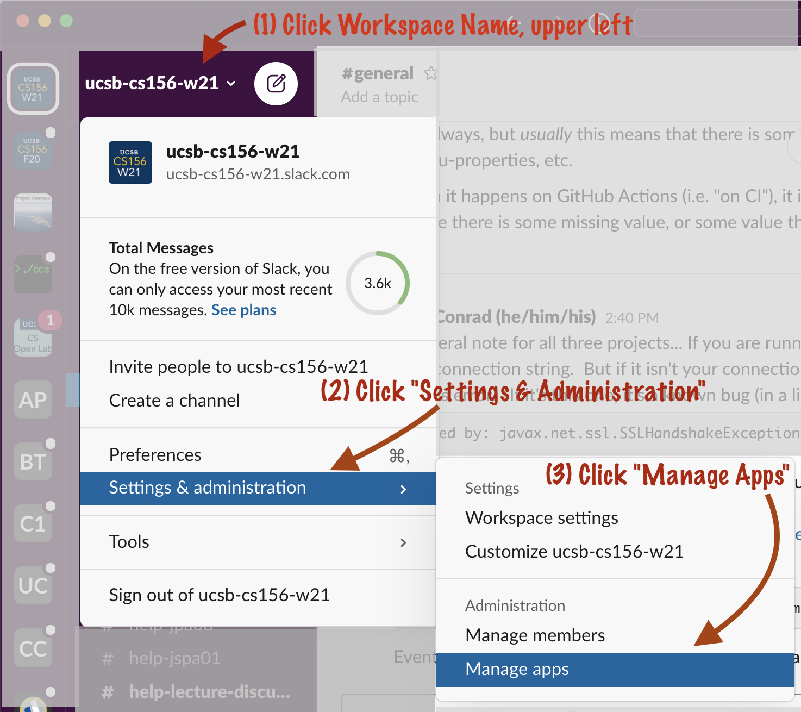
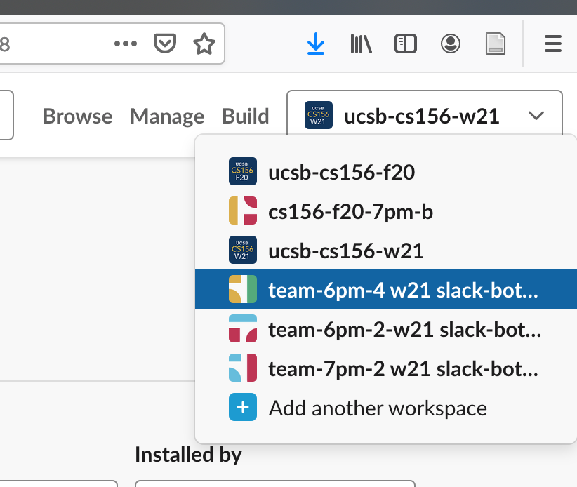
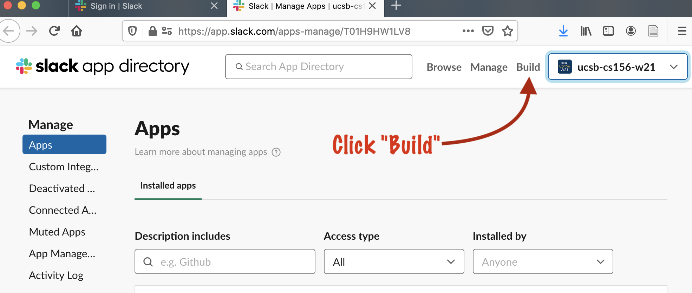
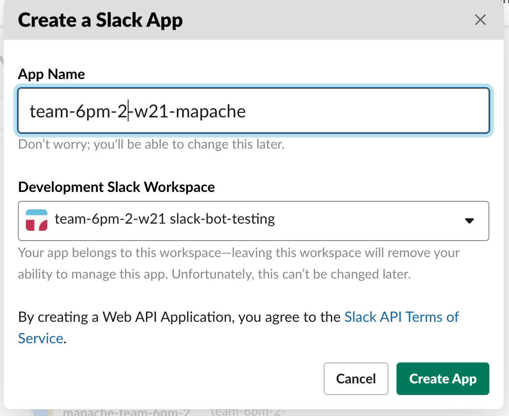
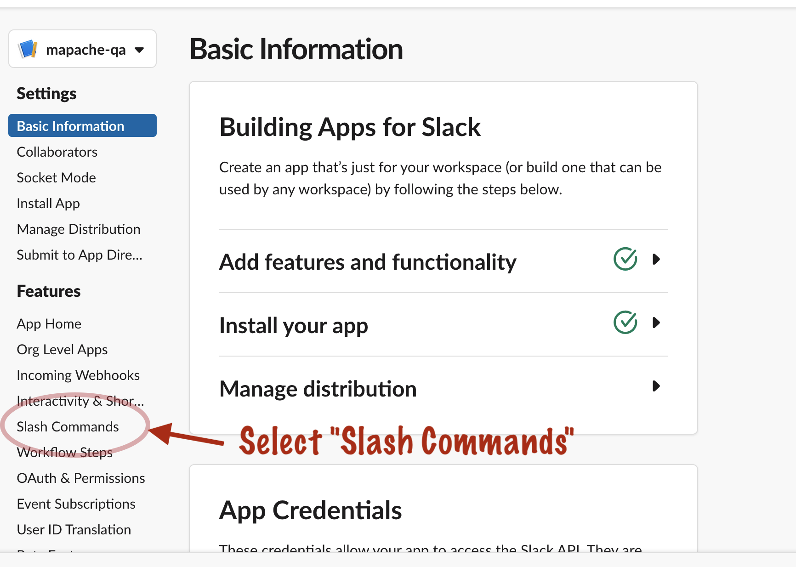
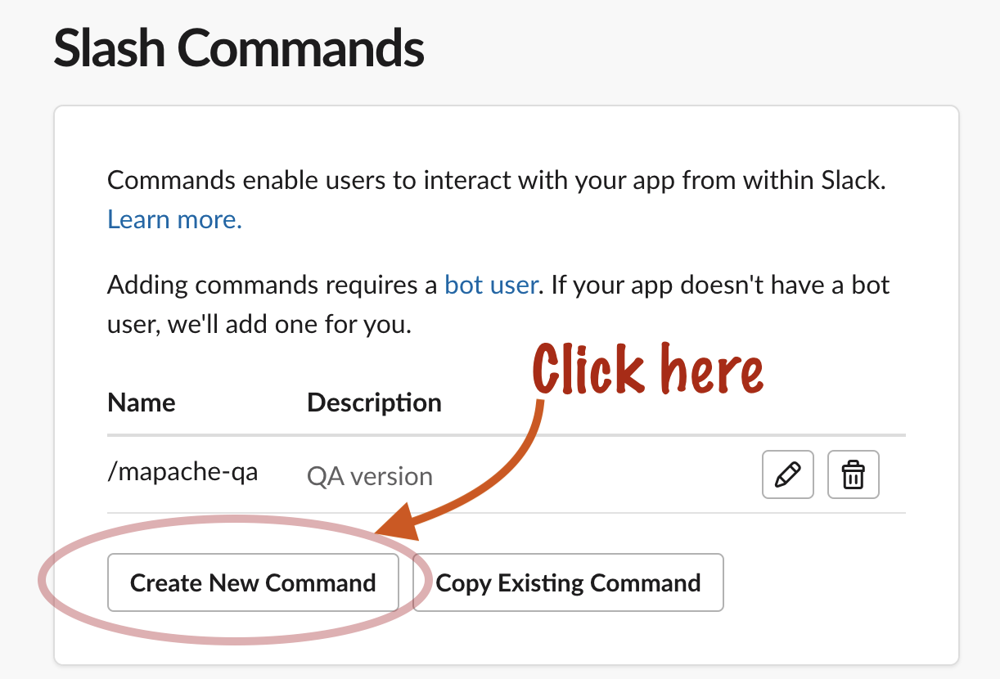
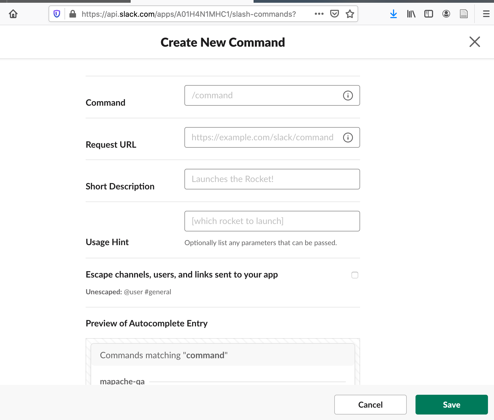
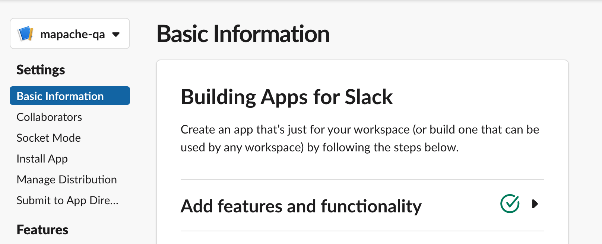
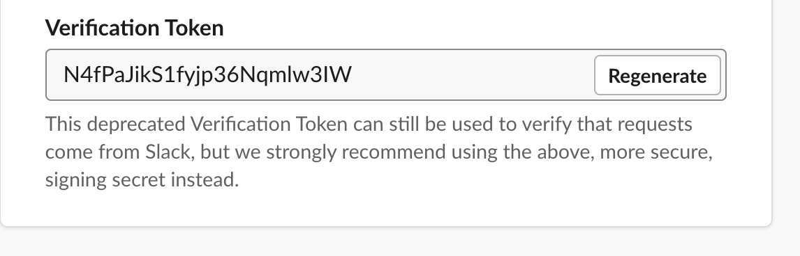

# Slack Slash Command Token

These instructions say how to get the value for `app.slack.slashCommandToken` that you need in your `temp-credentials.txt`.

This value eventually gets copied to both `secrets-localhost.properties`, and `secrets-heroku.properties`

## Step 1: Get admin privs in a Slack Workspace

If you are working on this app, you'll likely need a 
separate Slack Workspace as a test workspace (not one you actually use for real work), where you have
admin privileges.   For teams working on this app
in CMPSC 156, the staff typically sets up one such
workspace per team (or provides you instructions
to do that yourself).

If you've not been given any instructions about that,
ask the course staff before setting up your own
workspace from scratch.

## Step 2: In Slack Workspace, Click Manage Apps

Select "Manage Apps" in the Slack Workspace, as shown below:

This should bring up a web page in a browser; you may be asked to login into Slack first.  Choose your test workspace.

## Step 3: Select the appropriate Slack Workspace

On the resulting web page, you'll see a menu in the upper right hand corner where you can select a workspace.  Select your test workspace here.

## Step 4: Click the Build button 

Next to that menu, is a "Build" button.  Click this button.

## Step 5: Create a New Slack App

This should take you to a page where there is a list of Slack Apps (possibly empty if you haven't created any before.)  Either select an already existing slack app, or Click the "Create New App" button.

## Step 6: Name your new app

Fill in a name for your app, and select a slack workspace: 

## Step 7: Select Slash Commands

You'll arrive at this screen.   Down a ways, there is a Slash Commands item in the left hand column.  Click there.

## Step 8:  Create new Slash Command

You should see a form like this one. 

Click "Create new command"

## Step 9: Fill in new Slash Command Form

Now you see a form like this one:

Fill in the fields as follows:

* Command: `/mapache`
* Request URL: The URL for your Heroku app, followed by `/api/public/slash-command` 
* Short Description: A short description of your app.  I suggest using something like `W21 team-6pm-2 Mapache Slack Bot`
* Usage Hint: This should give your user an idea of what to type after `/mapache`.  We've been using `[time|status|debug]` which are three of the options that can follow `/mapache`.  
(We might change these up later.)

Click the Save button.

## Step 10: Get the Verification Token

Go back to the main page for your app, and in the left hand menu, find `Basic Information` as shown here:

If you scroll down this page, you'll find a section called `App Credentials`, and under that, a listing for a `Verification Token`, like this one (this is not a real token):

Copy the value from here; this is the value you will use for your `app.slack.slashCommandToken`

# Note on Deprecation

The use of Verification Tokens is deprecated by Slack.  We will need, at some point, to convert this app to using a _signing secret_ instead.   When that happens, this documentation should be updated as part of that Pull Request.